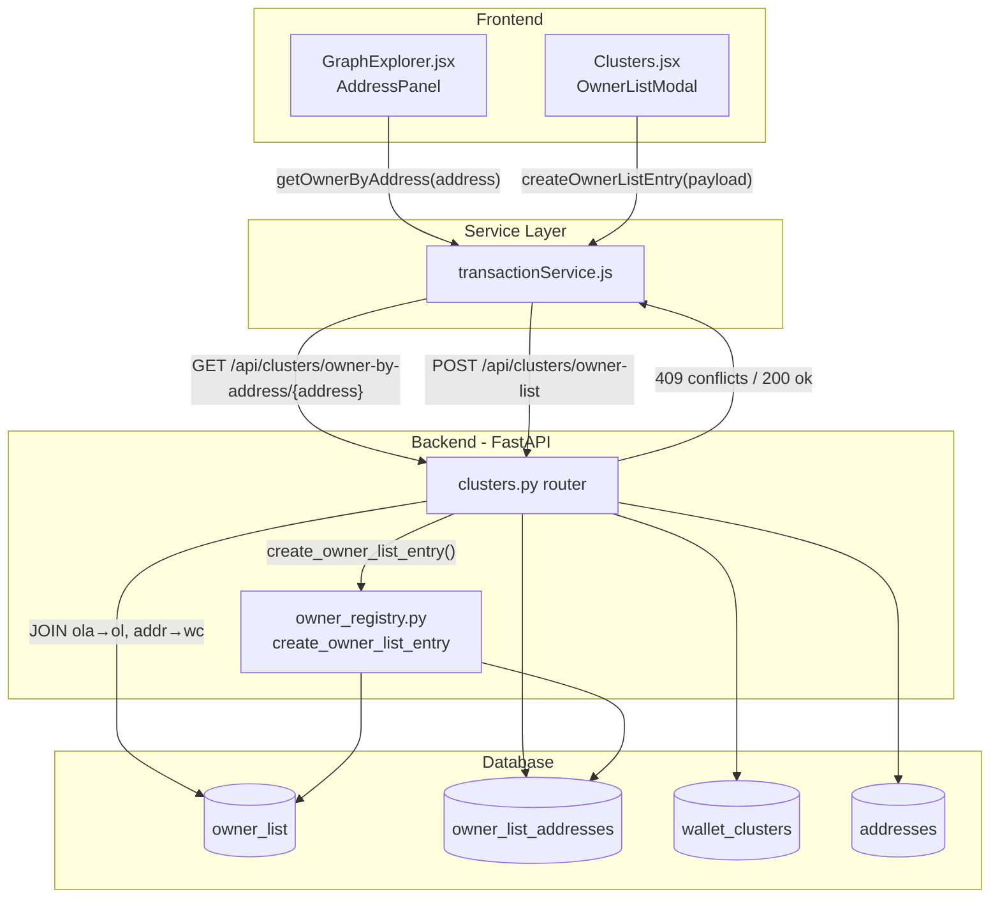

# Design Document: owner-update-graph-profile

## Overview

This feature adds two enhancements to the crypto-AML tracker:

1. **Duplicate Address Detection** — When an analyst submits the "Add / Update Owner" form with an address already assigned to another owner, the backend returns a 409 conflict response. The frontend catches this and shows a confirmation dialog before allowing the reassignment via a `force_override` flag.

2. **Owner Info in Graph Address Panel** — The `AddressPanel` in `GraphExplorer.jsx` gains a compact owner section (name, entity type, list category) populated by a new `GET /api/clusters/owner-by-address/{address}` endpoint. All existing panel content is preserved.

The changes touch three layers: a new FastAPI route, a modified `create_owner_list_entry` function in `owner_registry.py`, and two React component updates.

---

## Architecture



**Data flow for duplicate detection:**

1. `OwnerListModal` submits `POST /owner-list` (no `force_override`).
2. Backend queries `owner_list_addresses` for any submitted address.
3. If conflicts found → return 409 `{ conflicts: [{address, current_owner_name}] }`.
4. Frontend shows `ConfirmationDialog`; on confirm, resubmits with `force_override: true`.
5. Backend deletes old `owner_list_addresses` rows for those addresses, inserts under new owner.

**Data flow for owner panel:**

1. `AddressPanel` mounts / `address` prop changes → `useEffect` calls `getOwnerByAddress(address)`.
2. Service calls `GET /api/clusters/owner-by-address/{address}`.
3. Backend joins `owner_list_addresses → owner_list` and `addresses → wallet_clusters`.
4. Returns `{ owner_id, full_name, entity_type, list_category, risk_level }` or `{ owner: null }`.
5. Panel renders owner section above the stats grid.

---

## Components and Interfaces

### Backend: New Route — `GET /owner-by-address/{address}`

Added to `crypto-aml-tracker/backend-py/routes/clusters.py`.

```python
@router.get("/owner-by-address/{address}")
async def get_owner_by_address(address: str) -> dict:
    ...
```

**Response (found):**
```json
{
  "owner_id": 7,
  "full_name": "Dawit Alemu",
  "entity_type": "individual",
  "list_category": "watchlist",
  "risk_level": "normal"
}
```

**Response (not found):**
```json
{ "owner": null }
```

**Error:** 503 when MySQL pool is unavailable (reuses existing `_require_mysql()` helper).

---

### Backend: Modified Route — `POST /owner-list`

`OwnerListCreateRequest` gains one optional field:

```python
force_override: bool = Field(default=False)
```

`create_owner_list_entry` in `owner_registry.py` gains a `force_override` parameter. When `True` and duplicate addresses are found, it deletes the old `owner_list_addresses` rows before inserting the new ones instead of raising `ValueError`. When `False` (default), it raises `ValueError` as before — but the route handler now catches this specific case and returns 409 with structured conflict data instead of 422.

The route handler is updated to:
1. Query `owner_list_addresses` for conflicts **before** calling `create_owner_list_entry`.
2. If conflicts exist and `force_override` is `False` → return 409 with conflict list.
3. If `force_override` is `True` → pass through to `create_owner_list_entry` which handles deletion.

**409 Response body:**
```json
{
  "detail": "duplicate_addresses",
  "conflicts": [
    { "address": "0xabc...", "current_owner_name": "Hana Bekele" }
  ]
}
```

---

### Frontend: `transactionService.js`

New export:

```js
export const getOwnerByAddress = async (address) => {
  const res = await fetch(
    `${CLUSTER_URL}/owner-by-address/${encodeURIComponent(address)}`
  );
  if (!res.ok) throw new Error(`Backend error: ${res.status}`);
  return await res.json();
};
```

`createOwnerListEntry` is updated to **not** throw on 409 — instead it returns the parsed response body so the caller can inspect `res.status` and the conflict payload. The function signature stays the same; the caller (`handleOwnerSubmit`) is updated to handle the 409 case.

---

### Frontend: `GraphExplorer.jsx` — `AddressPanel`

A `useEffect` is added inside `AddressPanel` that fires whenever `address` changes:

```jsx
const [ownerInfo, setOwnerInfo] = useState(null);   // null = loading
const [ownerError, setOwnerError] = useState(false);

useEffect(() => {
  if (!address) return;
  setOwnerInfo(null);
  setOwnerError(false);
  getOwnerByAddress(address)
    .then((data) => setOwnerInfo(data))
    .catch(() => setOwnerError(true));
}, [address]);
```

The owner section is inserted **between the header and the stats grid** (after the existing header `<div>` and before the stats `<div>`). This keeps the panel's visual hierarchy: identity → ownership → statistics → links → transactions.

**Owner section states:**

| State | Display |
|---|---|
| Loading (`ownerInfo === null && !ownerError`) | Spinner / "Loading owner…" text |
| No owner (`ownerInfo.owner === null`) | "Unassigned" in muted text |
| Owner found | Name (bold), entity type pill, list category pill |
| Error | "Owner data unavailable" in muted red |

---

### Frontend: `Clusters.jsx` — `OwnerListModal`

Two new state variables are added to the parent `Clusters` component and passed as props:

```jsx
const [conflictData, setConflictData] = useState(null); // null = no conflict
```

`handleOwnerSubmit` is updated:

```js
// On 409:
const body = await res.json();
setConflictData(body.conflicts);   // show dialog

// On confirm:
await createOwnerListEntry({ ...payload, force_override: true });
setConflictData(null);

// On cancel:
setConflictData(null);
```

`OwnerListModal` receives `conflictData`, `onConfirmOverride`, and `onCancelOverride` as new props. When `conflictData` is non-null, a `ConfirmationDialog` is rendered **inside** the modal (overlaid on top of the form), controlled by those props.

`OwnerListModal` signature change:

```jsx
function OwnerListModal({
  open, form, submitting, error,
  onClose, onChange, onSubmit,
  conflictData,        // NEW: array of {address, current_owner_name} or null
  onConfirmOverride,   // NEW: called when analyst clicks Confirm
  onCancelOverride,    // NEW: called when analyst clicks Cancel
})
```

`createOwnerListEntry` in `transactionService.js` is updated to return the raw response on 409 (with a `_status: 409` marker) rather than throwing, so `handleOwnerSubmit` can branch on it.

---

## Data Models

### New Pydantic field on `OwnerListCreateRequest`

```python
force_override: bool = Field(default=False)
```

No database schema changes are required. The `owner_list_addresses` table already has a `UNIQUE KEY` on `address`; the override path deletes the conflicting row before re-inserting.

### API response types

**`GET /owner-by-address/{address}` — found:**
```typescript
{
  owner_id: number;
  full_name: string;
  entity_type: string;       // "individual" | "organization"
  list_category: string;     // "watchlist" | "sanction" | "exchange" | "merchant" | "other"
  risk_level: string;        // "normal" | "medium" | "high"
}
```

**`GET /owner-by-address/{address}` — not found:**
```typescript
{ owner: null }
```

**`POST /owner-list` — 409 conflict:**
```typescript
{
  detail: "duplicate_addresses";
  conflicts: Array<{ address: string; current_owner_name: string }>;
}
```

### Frontend state additions

| Component | State variable | Type | Purpose |
|---|---|---|---|
| `AddressPanel` | `ownerInfo` | `object \| null` | Owner API response; `null` = loading |
| `AddressPanel` | `ownerError` | `boolean` | True when fetch failed |
| `Clusters` | `conflictData` | `array \| null` | Conflict list from 409; `null` = no conflict |

---

## Correctness Properties

*A property is a characteristic or behavior that should hold true across all valid executions of a system — essentially, a formal statement about what the system should do. Properties serve as the bridge between human-readable specifications and machine-verifiable correctness guarantees.*

### Property 1: Duplicate address detection is exhaustive

*For any* set of submitted addresses where at least one already exists in `owner_list_addresses`, the `POST /owner-list` endpoint (without `force_override`) SHALL return a 409 response whose `conflicts` array contains exactly the addresses that were duplicates — no more, no fewer.

**Validates: Requirements 1.1**

---

### Property 2: Force-override reassigns all submitted addresses

*For any* set of addresses (including duplicates already assigned to other owners), submitting `POST /owner-list` with `force_override: true` SHALL result in every submitted address being linked to the new owner in `owner_list_addresses`, and the response SHALL be 200.

**Validates: Requirements 1.5, 1.7**

---

### Property 3: Owner panel displays all required fields

*For any* owner record returned by `GET /owner-by-address/{address}`, the rendered `AddressPanel` owner section SHALL contain the `full_name`, `entity_type`, and `list_category` values from that record.

**Validates: Requirements 2.1**

---

### Property 4: Existing panel content is preserved

*For any* combination of address stats and transaction data, adding the owner section to `AddressPanel` SHALL leave the stats grid, Etherscan links, and recent transactions list all present and unmodified in the rendered output.

**Validates: Requirements 2.5**

---

### Property 5: Owner lookup returns all required fields

*For any* address linked to an owner record in `owner_list_addresses`, the `GET /owner-by-address/{address}` endpoint SHALL return a response containing `owner_id`, `full_name`, `entity_type`, `list_category`, and `risk_level`, each matching the values stored in `owner_list` and `wallet_clusters`.

**Validates: Requirements 3.2, 3.5**

---

### Property 6: Owner lookup is idempotent

*For any* address, calling `GET /owner-by-address/{address}` multiple times without modifying the underlying data SHALL return identical responses on every call.

**Validates: Requirements 3.6**

---

## Error Handling

### Backend

| Scenario | HTTP Status | Response |
|---|---|---|
| MySQL pool unavailable | 503 | `{ "detail": "MySQL is not connected…" }` |
| Duplicate addresses, no `force_override` | 409 | `{ "detail": "duplicate_addresses", "conflicts": [...] }` |
| Validation error (missing required fields) | 422 | FastAPI default validation error |
| Unexpected exception in `create_owner_list_entry` | 500 | `{ "detail": "Owner insert failed: …" }` |
| Address not found in `owner-by-address` | 200 | `{ "owner": null }` |

The 409 path is handled **before** calling `create_owner_list_entry` so the function's internal `ValueError` for duplicates is no longer reachable in normal flow. The `ValueError` guard in `owner_registry.py` is kept as a safety net for direct calls.

### Frontend

| Scenario | Behavior |
|---|---|
| `POST /owner-list` returns 409 | Set `conflictData`, show `ConfirmationDialog` inside modal |
| `POST /owner-list` returns other error | Set `ownerFormError`, show inline error banner in modal |
| `getOwnerByAddress` fails | Set `ownerError = true`, show "Owner data unavailable" in panel |
| `getOwnerByAddress` returns `{ owner: null }` | Show "Unassigned" in panel |
| `getOwnerByAddress` in-flight | Show loading indicator in owner section |

The `createOwnerListEntry` service function is updated to return `{ _status: 409, ...body }` on a 409 response instead of throwing, so `handleOwnerSubmit` can branch without a try/catch for the conflict case. All other non-OK statuses continue to throw.

---

## Testing Strategy

### Unit / Example Tests

**Backend (`pytest`):**
- `test_get_owner_by_address_found` — seed an owner + address, call endpoint, assert all five fields.
- `test_get_owner_by_address_not_found` — call with unknown address, assert `{ "owner": null }`.
- `test_get_owner_by_address_503` — mock `get_pool()` to return `None`, assert 503.
- `test_post_owner_list_409_on_duplicate` — seed a duplicate address, POST without `force_override`, assert 409 with correct conflict list.
- `test_post_owner_list_200_with_force_override` — seed a duplicate, POST with `force_override: true`, assert 200 and address reassigned.
- `test_post_owner_list_200_no_duplicates` — POST with all-new addresses, assert 200.

**Frontend (`vitest` + `@testing-library/react`):**
- `test_confirmation_dialog_shown_on_409` — mock service to return 409, submit form, assert dialog visible.
- `test_confirmation_dialog_message` — assert exact dialog text and button labels.
- `test_confirm_resubmits_with_force_override` — click Confirm, assert second call includes `force_override: true`.
- `test_cancel_dismisses_dialog` — click Cancel, assert dialog gone, no second API call.
- `test_address_panel_loading_state` — mock pending promise, assert loading indicator.
- `test_address_panel_unassigned` — mock `{ owner: null }`, assert "Unassigned".
- `test_address_panel_error_state` — mock rejection, assert error message and stats still visible.

### Property-Based Tests

Property-based testing is appropriate here because the feature contains pure data-transformation logic (conflict detection, address reassignment, owner field projection) where input variation (different addresses, owners, risk levels) meaningfully exercises edge cases.

**Library:** `hypothesis` (Python) for backend properties; `fast-check` (TypeScript) for frontend properties.

**Minimum 100 iterations per property test.**

Each test is tagged with a comment referencing its design property:
```
# Feature: owner-update-graph-profile, Property N: <property_text>
```

**Property 1 — Duplicate detection is exhaustive:**
Generate a random set of addresses, insert a random subset into `owner_list_addresses`. POST the full set without `force_override`. Assert the 409 `conflicts` array contains exactly the pre-inserted subset.

**Property 2 — Force-override reassigns all addresses:**
Generate random addresses (some pre-existing under other owners). POST with `force_override: true`. Assert every submitted address is now linked to the new owner in `owner_list_addresses`.

**Property 3 — Owner panel displays all required fields:**
Generate random `{ full_name, entity_type, list_category }` objects. Mock `getOwnerByAddress` to return them. Render `AddressPanel`. Assert all three values appear in the rendered output.

**Property 4 — Existing panel content is preserved:**
Generate random stats objects and `edgesData` arrays. Render `AddressPanel` with the owner section present. Assert the stats grid keys, Etherscan link hrefs, and transaction list items are all still rendered.

**Property 5 — Owner lookup returns all required fields:**
Generate random owner records with varying `entity_type`, `list_category`, and `risk_level`. Seed them into the test DB. Call `GET /owner-by-address/{address}`. Assert all five fields match the seeded values.

**Property 6 — Owner lookup is idempotent:**
Generate a random address linked to an owner. Call the endpoint 3–5 times. Assert all responses are deeply equal.
